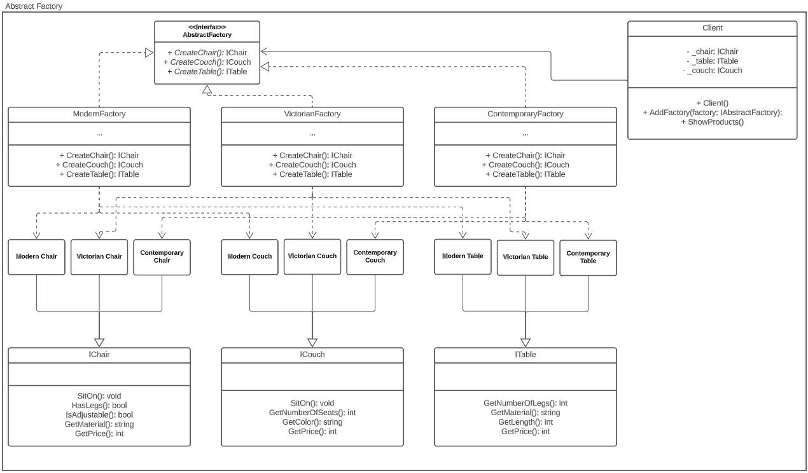

# Abstract Factory Pattern
The Abstract Factory pattern is a creational pattern that provides an interface for creating related objects without specifying their concrete classes.

## Problem
Suppose we want to create a furniture store application that can create different types of furniture like chairs, couches, and tables. We want to support different styles like modern, contemporary, and Victorian. We want to ensure that each style has its own set of products like `ModernChair`, `ModernCouch`, and `ModernTable`.

We could create a separate factory for each style, but this could lead to a lot of duplicate code. Additionally, if we add a new style of furniture, we would need to modify the existing code to accommodate the new style.

## Solution
The Abstract Factory pattern solves the above problem by providing an interface for creating families of related or dependent objects without specifying their concrete classes. It allows us to create a separate factory for each family of products, and clients can use the appropriate factory to create the products they need. This makes it easy to add new families of products without modifying the existing code.

In our example, we can create an `IAbstractFactory` interface that defines methods for creating different types of furniture like chairs, couches, and tables. We can then create concrete factories for each style like `ModernFactory`, `ContemporaryFactory`, and `VictorianFactory`. Each factory will implement the `IAbstractFactory` interface and provide their own implementation for creating furniture.

We can create interfaces for each type of furniture like `IChair`, `ICouch`, and `ITable`. We can then create concrete implementations for each style of furniture like `ModernChair`, `ModernCouch`, and `ModernTable`. Each implementation will implement the appropriate interface and provide their own implementation for the behavior of that furniture.

We can then create a `Client` class that uses the appropriate factory to create the products it needs based on the desired style.

## UML Diagram

