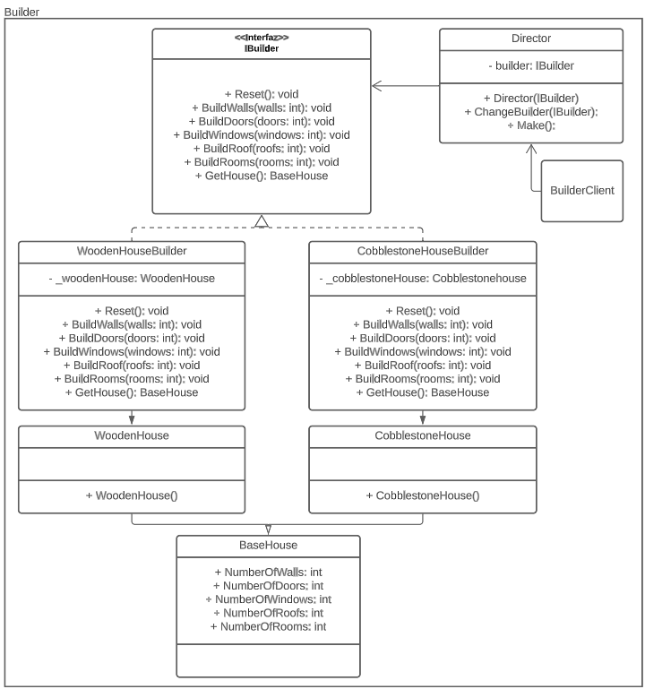

# Builder Pattern
The Builder pattern is a creation design pattern that allows the separation of object construction from its representation. 
It aims to simplify the creation of complex objects by providing a step-by-step approach to building them. The pattern is 
particularly useful when the creation process involves many steps that need to be executed in a specific order or when there 
are multiple ways to construct an object.

## Problem
In software development, there are situations where the construction of complex objects is required. One way to do this 
is to create a constructor with a large number of parameters. However, this approach can quickly become cumbersome, as the 
number of parameters grows, and it becomes difficult to manage all possible combinations of parameters.

For example, consider the construction of a house with many different features, such as the type of roof, wall material, 
and flooring. Creating a constructor with all these parameters would be unwieldy, and the object creation process would 
become more challenging to maintain.

## Solution
The Builder pattern addresses the problems described above by providing an interface for constructing objects step-by-step. 
The pattern consists of four main components: the `Director`, the `Builder` interface, the `ConcreteBuilder`, and the `Product`.

The `Director` is responsible for controlling the order in which the steps are executed to construct the object.

The `Builder` interface defines the steps needed to build the Product.

The `ConcreteBuilder` provides the implementation for the Builder interface, specifying how each step should be executed.

The `Product` represents the object being constructed.

By using the Builder pattern, we can create objects step-by-step, making it easier to manage the creation process and 
reducing the complexity of the constructor. Additionally, it allows for different representations of the same object to 
be created, making the pattern especially useful when there are multiple ways to construct an object.

In the given code, we have a `Director` class, an `IBuilder` interface, and two concrete builders, `WoodenHouseBuilder` and 
`CobblestoneHouseBuilder`. Each builder implements the IBuilder interface to create a specific `Product`: `WoodenHouse` and 
`CobblestoneHouse`. The `Director` controls the process of constructing the `Product` by calling the appropriate methods in the 
`Builder` interface. This way, we can create houses step-by-step without worrying about the details of the construction process.

## UML Diagram
