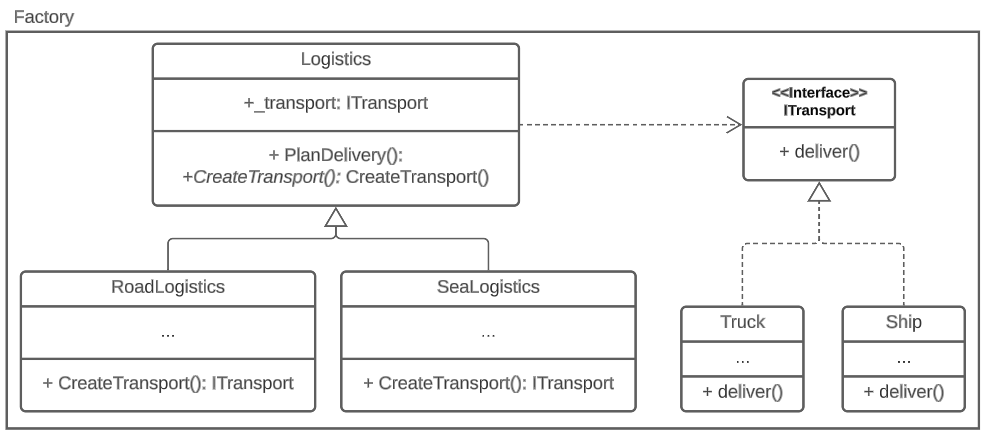

# Overview
The factory pattern is a creation design pattern that 
provides an interface for creating objects in a superclass, 
but allows subclasses to alter the type of objects that will 
be created. This pattern is used to create objects in a superclass 
without exposing the instantiation logic to the client code.

## Usage
In this project, we have two concrete classes, `Truck` and 
`Ship`, both implementing the `ITransport` interface, and two 
factories, `RoadLogistics` and `SeaLogistics`, both implementing 
the Logistics interface. The `RoadLogistics` factory creates 
`Truck` objects, and the `SeaLogistics` factory creates `Ship` 
objects.

## UML Diagram

