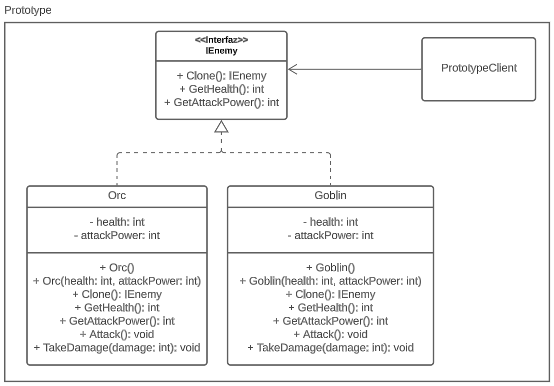

# Prototype

The Prototype design pattern is a creational design pattern that enables the creation of new 
objects by cloning existing ones. This pattern is useful when the cost of creating a new object 
is expensive, and it is advantageous to copy an existing object to modify its properties.

## Problem
Suppose you need to create a spawner of enemies in a game. Creating new objects for each enemy 
is costly, so you want to use an existing enemy as a prototype and clone it to create new ones. 
The new enemies need to be identical to the original enemy except for a few properties.

## Solution
In this example, we use the Prototype design pattern to create a spawner of enemies. We have 
an `IEnemy` interface that defines the methods that every enemy should implement. We also have 
two classes that implement this interface: `Orc` and `Goblin`. Both classes have default values 
for health and attack power, but we can create instances of these classes with different values 
by passing parameters to their constructors.

We create prototype objects of `Orc` and `Goblin` and a prototype object of a `damaged Orc`. We 
then create clones of these prototype objects to create new enemies with different properties. 
We can then attack these enemies to see that they have different stats.

## UML Diagram
