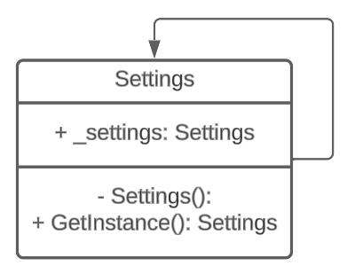

# Settings Class

The `Settings` class is a singleton class that provides access to application settings.

## Usage

To use the `Settings` class, call the `GetInstance` property:

```csharp
var settings = Settings.GetInstance();
```

The Singleton pattern could be improved by adding thread security.
To do so, you must add a lock for threads syncing.

In `Settings.cs` add the following:
```csharp
private static readonly object _lock = new object();
```

And for this to take effect, you must modify the constructor as well

```csharp
public static Settings GetInstance()
{
    if(_settings == null) {
        lock(_lock)
        {
            _settings = new Settings();
        }
    }
    
    return _settings;
}
```

# UML Diagram


